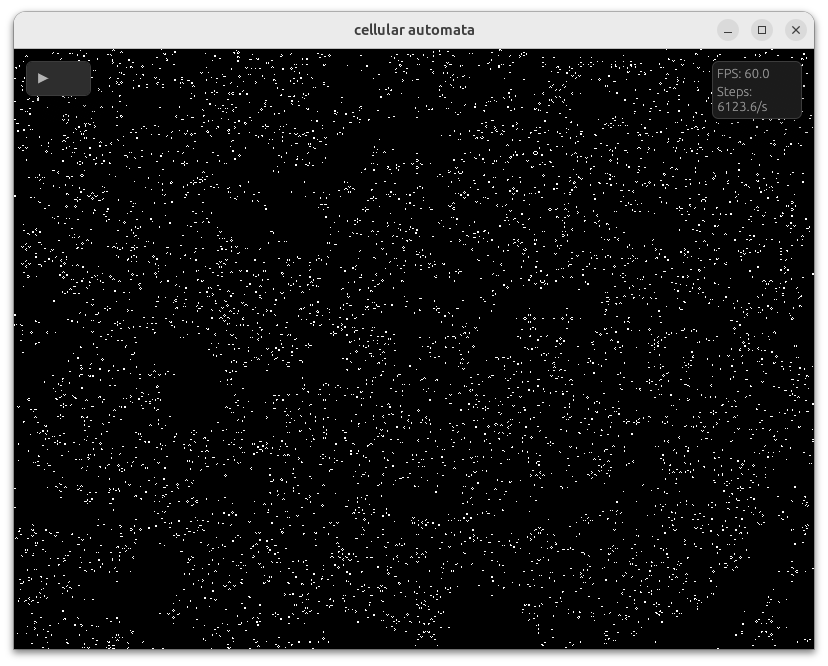

# cellular-automata

A simple rock paper scissors based simulation running entirely on the GPU.

The entire thing is just 2 shaders: 1 for logic and 1 for rendering.

On an RTX 4090 it can easily do over 6000 ticks per second.
Even integrated graphics can run 240 ticks per second without dropping frames.



## Download a ready-made executable

GitHub Actions builds release binaries for Linux, Windows, and macOS.

1. Open the repo's `Releases` page on GitHub.
2. Download the archive for your platform.
3. Extract it.
4. Run `cellular-automata` on Linux/macOS or `cellular-automata.exe` on Windows.

To publish those downloadable binaries, create and push a version tag such as `v0.1.0`:

```bash
git tag v0.1.0
git push origin v0.1.0
```

That triggers `.github/workflows/release.yml`, which builds the executables and attaches them to the GitHub Release automatically.
